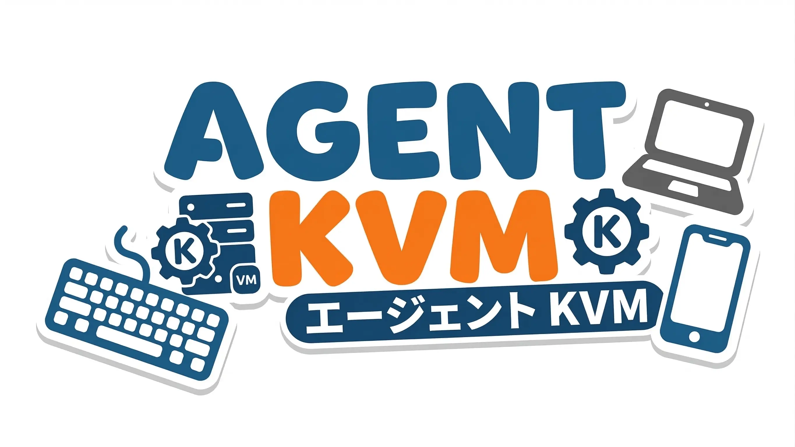

<p align="center">
  
</p>

<h1 align="center">AgentKVM</h1>

<p align="center">
  Let your AI agent control any physical device - Phones, Tablets, PCs, and more.
</p>

---

> **Early Stage Project** — AgentKVM is still in very early development. APIs, commands, and behavior may change. Issues and contributions are welcome!

AgentKVM is a CLI tool that lets AI agents see and control physical devices through KVM hardware.

**Supported devices:**
- [NanoKVM-USB](https://wiki.sipeed.com/hardware/en/kvm/NanoKVM_USB/) — currently supported

**Planned:**
- [PiKVM](https://pikvm.org/) — planned
- [NanoKVM](https://wiki.sipeed.com/nanokvm) (network version) — planned

AgentKVM bridges the gap between AI and the physical world. An AI agent takes screenshots to observe a device's screen, then sends mouse clicks, keyboard input, and scroll events to interact with it - enabling true "computer use" on real hardware.

## How It Works
1. **See** — Capture the device's screen via HDMI → `agentkvm screenshot`
2. **Think** — AI analyzes the screenshot to understand the UI
3. **Act** — Send mouse/keyboard input via USB HID → `agentkvm mouse click`, `agentkvm type`, `agentkvm key`

## Quick Start

Copy the prompt below and send it to your AI agent - it will guide you through the entire setup process. Of course, if you're a human, you can also follow the [Quick Start Guide](./QuickStart.md) yourself.

```text
Help me install and configure AgentKVM (https://github.com/iamtwz/agentkvm).

1. First, read the Quick Start guide: https://raw.githubusercontent.com/iamtwz/agentkvm/main/QuickStart.md
2. Then follow the steps to install AgentKVM and set up my device.
```

## Agent Skill

AgentKVM provides an [Agent Skill](https://agentskills.io) that lets AI agents use it directly. Install with either:

```bash
# Via Agent Skills
npx skills add iamtwz/agentkvm

# Via OpenClaw (ClawHub)
npx clawhub@latest install agentkvm
```

Once installed, your AI agent will automatically know how to take screenshots, click, type, and scroll on your connected devices.

## Development

```bash
git clone https://github.com/iamtwz/agentkvm.git
cd agentkvm
pnpm install
pnpm dev -- list                # Run in development mode
pnpm test                       # Run tests (204 tests)
pnpm typecheck                  # TypeScript type check
pnpm build                      # Build for production
```

## License

MIT
